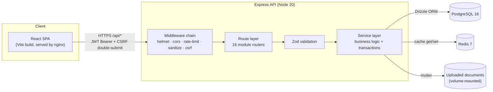

# Architecture

Innocito CRM is a two-service application: a stateless Express/TypeScript API
and a React SPA, backed by PostgreSQL (system of record) and Redis (cache +
rate-limit store, with an automatic in-memory fallback if Redis is
unavailable). Both services are independently buildable, testable, and
deployable — in Docker Compose for local/self-hosted use, or as two Railway
services for the hosted deployment.



## Backend

**Stack:** Node 20, Express 4, TypeScript (strict), Drizzle ORM + `pg`,
PostgreSQL 16, Redis 7 (via `ioredis`), Zod, `argon2` (password hashing),
`jsonwebtoken`, Vitest + Supertest.

**Why Drizzle over Prisma:** Prisma's engine binaries are fetched from
`binaries.prisma.sh` at `generate` time; that domain isn't reachable from every
build environment (it wasn't from the one this project was built in). Drizzle
is a thin, binary-free query builder over `pg`, so `npm install` is the only
build-time dependency — no engine download, no platform-specific binary
matching in Docker multi-stage builds.

**Folder structure** (`backend/src/`):

```
config/       env validation (zod), db pool + drizzle instance, redis client, logger
db/           schema.ts (single source of truth), migrations/, seed.ts, migrate.ts
middleware/   auth (JWT verify + RBAC), validate, csrf, sanitize (xss), rate-limit, error handler
modules/      one folder per domain — auth, users, roles, companies, contacts,
              leads, campaigns, meetings, tasks, documents, comments,
              notifications, activities, auditLogs, dashboard, search, reports
utils/        ApiError, asyncHandler, pagination, permissions registry,
              lead-number formatter, audit logger, activity logger, notifier
```

Each domain module follows the same layering: **routes** (wires HTTP verbs to
controllers behind `authenticate`/`requirePermission` middleware) → **controller**
(thin — extracts req, calls service, shapes response) → **service** (the actual
business logic: transactions, cross-entity side effects, activity/audit
recording) → **validation** (Zod schemas shared between `create` and `update`
paths). This mirrors a classic repository/service pattern without a formal
repository class, since Drizzle's query builder already *is* the repository
layer — an extra abstraction on top of it would just be indirection.

**Cross-cutting concerns implemented once, applied everywhere:**

- **Auth & RBAC** — `middleware/auth.ts` verifies the JWT access token and
  attaches `req.user`; `requirePermission(key)` / `requireRole(...)` gate
  individual routes against the `PERMISSIONS` registry (`utils/permissions.ts`).
  Ownership-based edit rules (`LEADS_EDIT_OWN` vs `LEADS_EDIT_ANY`) are checked
  in the service layer, since they need the record's `assignedToId` /
  `currentOwnerId` to evaluate.
- **Validation** — every mutating route runs its body/query through a Zod
  schema (`middleware/validate.ts`); invalid input never reaches a service.
- **Audit logging** — `utils/auditLogger.ts#recordAudit` is called from every
  create/update/delete/export/login path, writing before/after snapshots to
  `audit_logs`.
- **Activity timeline** — `utils/activityLogger.ts#recordActivity` writes a
  human-readable timeline entry (assignment, status change, meeting scheduled,
  comment added, etc.) any time something happens to a lead — this is what
  powers the Timeline tab and the global Activities feed without any
  duplicated bookkeeping in each module.
- **Notifications** — `utils/notifier.ts#notifyUser` inserts a row a user will
  see in the bell menu (assignment, task due, overdue follow-up).
- **Caching** — `config/redis.ts#CacheClient` wraps Redis with a capped retry
  strategy and an in-memory `Map` fallback, so the dashboard summary endpoint
  (the one genuinely expensive aggregate query) stays fast and the app still
  works if Redis is down.
- **Errors** — every thrown `ApiError` (or raw Postgres error — unique/FK/
  not-null violations are translated to 409/400 with a clear message) is
  caught by `middleware/errorHandler.ts` and returned as a consistent
  `{ success: false, message, details? }` envelope; nothing ever leaks a raw
  stack trace to the client in production.

## Frontend

**Stack:** React 18, TypeScript, Vite, Tailwind CSS, a hand-built shadcn/ui-style
component library (Radix UI primitives + `class-variance-authority` +
`tailwind-merge`), React Router v6, TanStack React Query, React Hook Form +
Zod, Zustand (auth state only — everything else is server state), Recharts.

**Folder structure** (`frontend/src/`):

```
components/ui/       19 primitive, fully reusable components (button, input,
                      select, dialog, table, tabs, ...) — the design system
components/shared/    composed, still-generic building blocks: DataTable,
                      Pagination, PageHeader, KpiCard, StatusBadge,
                      ConfirmDialog, EmptyState, UserPicker
components/layout/    TopNav, Sidebar, GlobalSearch, NotificationsMenu,
                      UserMenu, AppLayout
pages/                one folder per module (leads/, companies/, contacts/,
                      campaigns/, users/) plus top-level pages for
                      Dashboard/Meetings/Tasks/Documents/Activities/
                      Reports/Settings/AuditLogs
api/                  one file per domain — thin wrappers pairing a React
                      Query hook with an axios call; this is the *only*
                      place that knows the REST shape
lib/                  axios instance + refresh interceptor, permissions
                      registry (mirrors the backend's), chart color tokens,
                      formatting/utility helpers
store/                Zustand auth store (user, access token, permission
                      helpers) — session state, not server state
types/                shared TS interfaces/enums, generated by hand to match
                      the Drizzle schema's shape as returned by the API
```

Every list page follows the same recipe: `useSearchParams` holds
page/search/filter/sort state (so filters survive a refresh and are
shareable via URL), a `use<Entity>` React Query hook fetches paginated data,
a `<DataTable>` renders it with sortable columns, and a `<Pagination>` footer
drives page changes. Every detail page follows the same recipe: a query hook
fetches the record with its relations, a left column shows read-mostly
summary cards, a right column holds a `<Tabs>` block for the entity's
sub-resources (meetings/tasks/documents/comments/timeline for leads), and
edit/assign/delete are dialogs layered on top rather than separate routes —
so the user never loses their place.

**Design system discipline:** every visual primitive (button, badge, card,
dialog, ...) lives once in `components/ui/`, is styled only through Tailwind
utility classes + `class-variance-authority` variants, and is composed — never
copy-pasted — into feature pages. Adding a new "kind" of button/badge/status
color is a one-line change to the primitive, not a search-and-replace across
pages. Chart colors follow a validated, colorblind-safe palette
(`lib/chartColors.ts`) with a fixed categorical hue order, a single-hue
sequential ramp for the pipeline funnel, and reserved status colors for
won/lost — never an arbitrary per-chart color choice.

**Data flow:** React Query owns all server state (caching, refetch-on-focus,
optimistic-enough invalidation on mutation success); Zustand owns only the
authenticated user + access token, exposing `hasPermission()` / `hasRole()`
selectors that both route guards (`ProtectedRoute.tsx`) and inline UI
(`{hasPermission(...) && <Button>...}`) read from. There is no separate global
"app state" store — if it comes from the API, it's a React Query cache entry.

## Security posture

- **AuthN:** short-lived JWT access token (returned in the login response body,
  held in memory/Zustand — never localStorage) + a rotating refresh token
  stored as an httpOnly, secure cookie and hashed (`refresh_tokens.token_hash`)
  server-side, so a stolen DB dump doesn't yield usable tokens.
- **AuthZ:** RBAC via the `permissions` registry; every mutating route is
  gated server-side (the frontend's permission checks are UX only — a hidden
  button is not a security boundary).
- **CSRF:** double-submit cookie pattern on the cookie-authenticated
  `/auth/refresh` and `/auth/logout` routes.
- **XSS:** `xss` sanitizes every request body before it reaches a service or
  the database.
- **SQLi:** Drizzle's parameterized query builder — no raw string
  concatenation into SQL anywhere in the codebase.
- **File uploads:** `multer` with a MIME-type allowlist and randomized
  on-disk filenames (the original filename is preserved only as metadata).
- **Rate limiting:** a stricter limiter on `/auth/login` (brute-force
  protection) and a general limiter on `/api/*`.
- **Headers:** `helmet` defaults, CORS locked to the configured `CLIENT_ORIGIN`.

## Testing

Backend: Vitest + Supertest running against a real, dedicated
`innocito_crm_test` Postgres database (not mocked) — unit tests for pure
utilities (lead-number formatting, permission checks) and integration tests
that exercise full HTTP round-trips for auth, RBAC enforcement, the full lead
lifecycle (create → search → status transitions → assignment → ownership-based
edit → delete), and admin-only user management.
