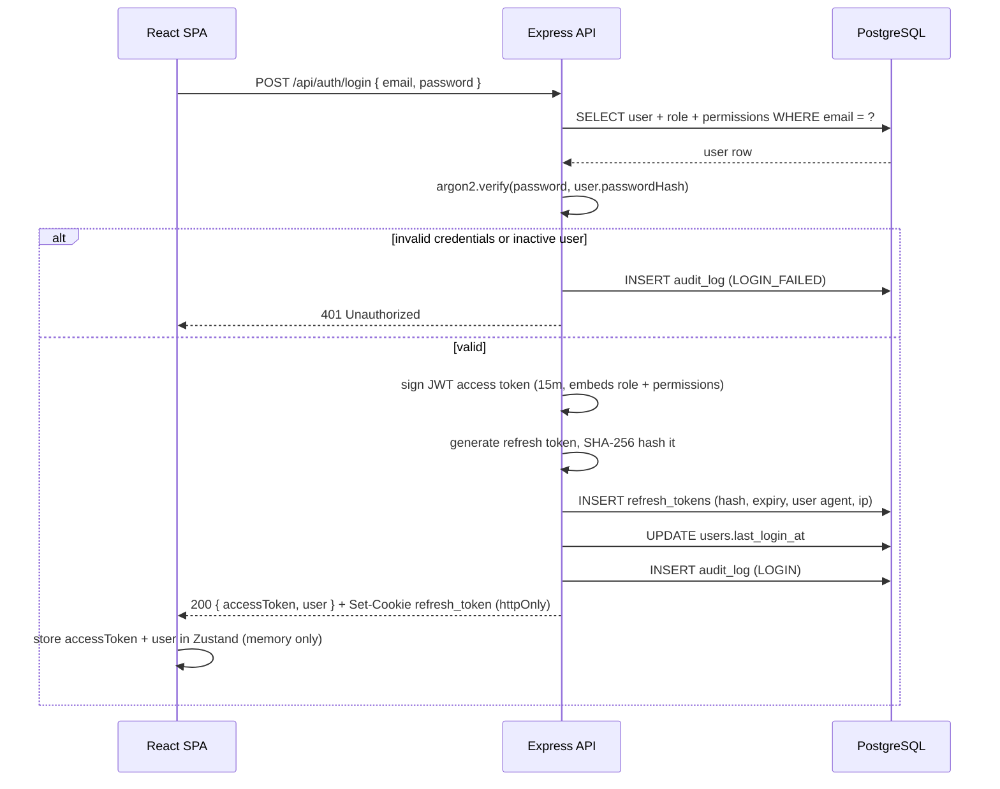
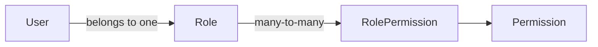

# Authentication & Authorization Flow

## Principles

- **No self-registration.** There is no `POST /api/auth/register`. The only
  way an account is created is `POST /api/users` by an authenticated Admin
  (`requirePermission(PERMISSIONS.USERS_MANAGE)`). New users get a
  server-generated temporary password and `mustChangePassword: true`.
- **Two-token model.** A short-lived JWT **access token** (default 15m,
  `JWT_ACCESS_EXPIRES_IN`) carries identity + role + the full permission list,
  and is sent as `Authorization: Bearer <token>` on every API call. A
  longer-lived, rotating **refresh token** (default 7d,
  `JWT_REFRESH_EXPIRES_IN`) lives only in an httpOnly, `Secure`, `SameSite=Strict`
  cookie scoped to `/api/auth`, so JavaScript can never read it (XSS can't
  steal it) and it's never sent to any route but the auth ones.
- **Refresh tokens are hashed at rest.** The `refresh_tokens` table stores
  `token_hash` (SHA-256), never the raw value — a database leak doesn't hand
  out usable sessions.
- **Rotation on every refresh.** `POST /api/auth/refresh` revokes the
  presented token and issues a new one in the same call. A replayed old
  refresh token is rejected (`revoked_at` is set), which limits the blast
  radius of a stolen-but-unused cookie.

## Login sequence



## Silent refresh (axios interceptor)

`frontend/src/lib/api.ts` installs a response interceptor: any `401` from a
non-auth route triggers exactly one in-flight `POST /api/auth/refresh` call
(subsequent 401s while a refresh is already in-flight await the same promise
instead of firing duplicate refreshes), which relies on the browser
automatically attaching the httpOnly cookie. On success, the new access token
replaces the one in the Zustand store and the original failed request is
retried once with the new token. On failure (refresh token expired/revoked),
the session is cleared and the router redirects to `/login`.

On app boot, `useAuthBootstrap()` calls `GET /api/auth/me` (which itself relies
on a still-valid access token or triggers the same refresh flow) to restore
the session — this is what makes an existing login survive a page reload
without re-entering credentials, while never persisting the access token to
localStorage/sessionStorage.

## CSRF protection

`/api/auth/refresh` and `/api/auth/logout` are cookie-authenticated (the
browser sends the refresh cookie automatically), which makes them CSRF targets
in a way that Bearer-token routes aren't. `middleware/csrf.ts` issues a
non-httpOnly `csrf_token` cookie on every response and requires it to be
echoed back in an `x-csrf-token` header on state-changing requests to those
routes (double-submit cookie pattern) — a cross-site form post can trigger the
cookie to be sent, but can't read it to also set the header.

## Authorization (RBAC)



Five fixed roles (`ADMIN`, `INSIDE_SALES`, `SALES`, `DELIVERY`, `MANAGEMENT`)
are seeded once; what each role can *do* is data (`role_permissions` rows
against a fixed `permissions` registry), not code, so re-granting a
capability to a role is a one-line change in `backend/src/db/seed.ts` plus a
re-run, not a redeploy of route logic.

Every mutating route declares its required permission explicitly:

```ts
leadsRouter.delete('/:id', requirePermission(PERMISSIONS.LEADS_DELETE), controller.remove);
```

`requirePermission` reads the permission list embedded in the caller's JWT
(no extra DB round-trip per request) and 403s if it's missing. Two
permissions get extra, request-body-aware handling in the **service** layer
rather than the middleware:

- `LEADS_EDIT_OWN` vs `LEADS_EDIT_ANY` — Inside Sales can edit a lead they
  created or are assigned to; only `LEADS_EDIT_ANY` (Admin/Management) can
  edit anyone's. This can't be decided from the JWT alone since it depends on
  the specific lead row, so `leads.service.ts#updateLead` loads the lead first
  and compares `assignedToId`/`createdById` against `req.user.sub` before
  falling back to the `LEADS_EDIT_ANY` check.
- **Self-disable / self-role-change prevention** — `users.service.ts` blocks
  an Admin from disabling or demoting their own account, so there's always at
  least one active Admin session able to fix a mistake.

On the frontend, `useAuthStore().hasPermission(key)` / `.hasRole(...roles)`
drive both route guards (`<RequirePermission>`, `<RequireRole>` in
`routes/ProtectedRoute.tsx`, which redirect to `/dashboard` rather than
rendering a 403 page) and conditional UI (hiding a "Delete" button someone
can't use). This is a UX convenience only — every one of these checks is
re-enforced server-side, since a hidden button is not a security boundary.

## Password lifecycle

- **Admin-created account:** temporary password generated server-side,
  returned once in the `POST /api/users` response (shown to the Admin in a
  toast in the UI), `mustChangePassword: true`.
- **Self-service change:** `POST /api/auth/change-password` requires the
  current password, hashes the new one with `argon2`, clears
  `mustChangePassword`, and **revokes every outstanding refresh token for that
  user** — so changing your password logs out every other session.
- **Admin-triggered reset:** `POST /api/users/:id/reset-password` (Admin
  only) generates a fresh temporary password without requiring the old one —
  the escape hatch for a locked-out user.
- **Disable = immediate logout:** `PATCH /api/users/:id/active` with
  `isActive: false` doesn't just block future logins — it also revokes that
  user's refresh tokens, so an already-open session is cut off, not just
  future ones.

## Password hashing

`argon2` (the current OWASP-recommended default) rather than bcrypt — memory-hard,
resistant to GPU/ASIC cracking, and the Node bindings are actively maintained.
