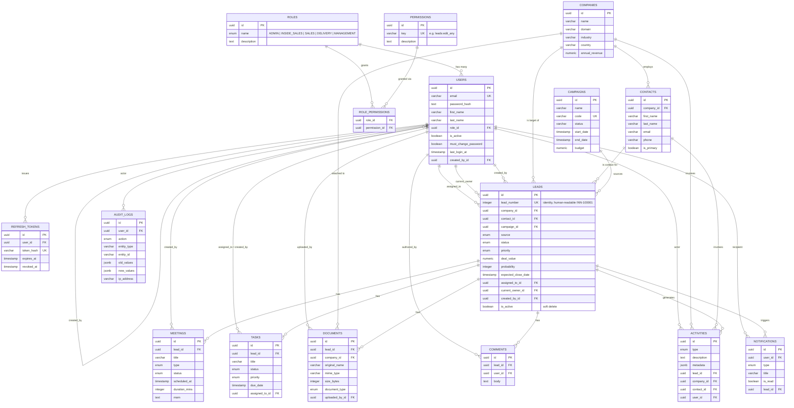

# Entity-Relationship Diagram

Sixteen normalized tables, UUID primary keys throughout, indexed on every foreign
key and every column used for filtering/sorting in the API (status, source,
priority, dates, read/unread flags). Full column definitions live in
`backend/src/db/schema.ts`; migrations are generated with `drizzle-kit` into
`backend/src/db/migrations/`.

## Notable design decisions

- **`leads.lead_number`** is a Postgres `GENERATED ALWAYS AS IDENTITY` integer,
  formatted as a display ID (`INN-100001`) in the API layer — human-friendly,
  monotonic, and collision-free without an extra sequence table.
- **Soft delete on leads** (`is_active`) instead of hard delete, so the audit
  trail and historical reporting stay intact after a lead is "deleted" from the UI.
- **`assigned_to` vs `current_owner`** are modeled as two separate FKs to `users`
  on `leads`, matching the real workflow: Inside Sales owns qualification and
  routing (`assigned_to`), while Sales/Delivery drives the deal to close
  (`current_owner`). Both are optional and independently reassignable.
- **`activities`** is a single polymorphic timeline table (nullable FKs to
  lead/company/contact) so one query can answer "everything that happened here"
  for any entity, and a global feed is just `WHERE lead_id IS NOT NULL ORDER BY
  created_at DESC LIMIT 50`.
- **RBAC is data-driven**, not hardcoded: `roles` ← `role_permissions` →
  `permissions` means granting a role a new capability is a data change, not a
  code change. The seed script wires up the five default roles against a fixed
  `PERMISSIONS` registry shared (by convention) between backend and frontend.
